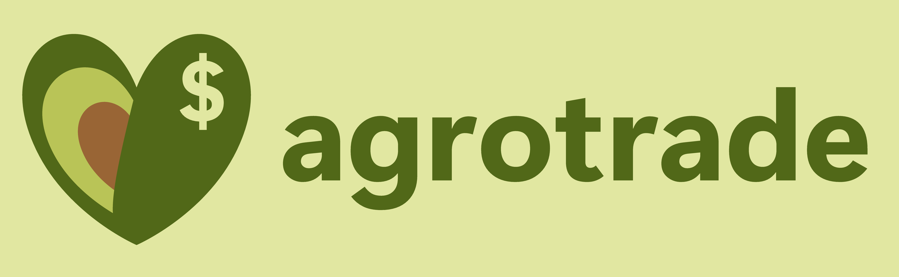
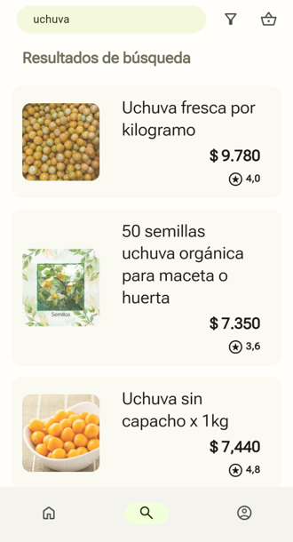
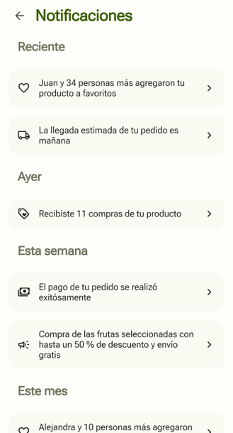

# Agrotrade



## Overview

Agrotrade is a frontend prototype for a web-based e-commerce platform designed for the agricultural market. It provides a clean, mobile-first interface for users to buy and sell agricultural goods like fruits and vegetables. The application features a complete user flow, from registration and browsing to purchasing and order tracking.

The user interface is built with a custom [Material You-inspired design system](https://github.com/dejesusbg/md3), featuring dynamic color theming that adapts the UI's color palette based on a primary and secondary color seed. This is achieved using vanilla JavaScript and CSS, with helper libraries like `chroma.js` and `vibrant.js`.

## Key Features

*   **User Authentication:** Secure screens for user registration and login.
*   **Product Discovery:**
    *   A homepage displaying trending products, recently viewed items, and special offers.
    *   A dedicated search page with search history and trending queries.
    *   Category pages for different product collections.
*   **E-Commerce Functionality:**
    *   Detailed product pages with images, descriptions, pricing, user reviews, and suggestions.
    *   A shopping basket to manage selected items.
    *   A streamlined checkout process with options for credit card and PSE payments.
    *   Order status tracking for purchased items.
*   **User Profile Management:**
    *   A central profile hub to manage personal data, view order history, and access favorite products.
    *   Options to manage payment methods and privacy settings, including password changes and account deletion.
*   **Selling Interface:** A simple form for users to create and manage their own product listings, including title, price, details, and images.
*   **Notifications:** A dedicated section for users to receive updates on their orders, product engagement (like favorites), and promotional campaigns.
*   **Dynamic Theming:** Implements a custom Material You-like theming engine that generates a full color palette from a base color, applying it across all UI components.

## Tech Stack & Project Structure

The project is built entirely with client-side technologies, making it a lightweight and fast-loading prototype.

*   **Core:** HTML5, CSS3, JavaScript (ES6)
*   **Styling:**
    *   `css/main.css`: Contains the primary layout and custom component styles for the application.
    *   `css/material-you/`: A collection of stylesheets that form a custom design system, including `button.css`, `fab.css`, `icon-button.css`, and `typography.css`.
*   **Dynamic Theming:**
    *   `js/material-you/monet.js`: The core script for generating the color palette.
    *   `js/material-you/chroma.min.js`: A library for color conversions and manipulations.
    *   `js/material-you/vibrant.min.js`: A library used to extract prominent colors from images, which can be used to power the theme dynamically (though the current implementation uses a hardcoded seed color).
*   **Structure:**
    *   **Root (`/*.html`):** Contains the main entry points of the app like `index.html`, `profile.html`, `search.html`, etc.
    *   **`/common`:** A directory housing shared sub-pages for features like login, product management, and profile sections.
    *   **`/css`:** Contains all application stylesheets.
    *   **`/js`:** Contains all application logic and theming scripts.
    *   **`/img`:** Stores static image assets like the logo.

## Getting Started

As this is a static frontend project, no build process or server is required to run it.

1.  **Clone the repository:**
    ```sh
    git clone https://github.com/dejesusbg/agrotrade.git
    ```

2.  **Navigate to the project directory:**
    ```sh
    cd agrotrade
    ```

3.  **Open the application in your browser:**
    To start the user journey from the beginning, open the `common/login/login.html` file in your web browser. Alternatively, you can open `index.html` to view the main homepage directly.


## Screenshots



